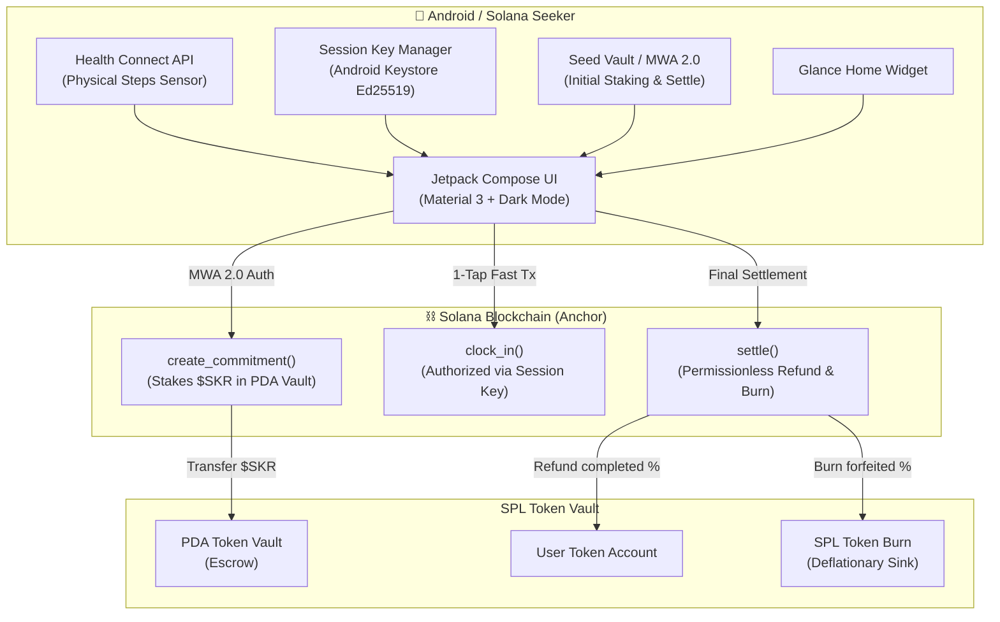

# ⚡ bozPledge (Clock In)
### Sovereign Physical Habit & Proof-of-Action Protocol on Solana Mobile
**Third Solana Mobile Hackathon: CLOCK IN (Fall 2026)**
**Repository:** [https://github.com/elaris-xyz/bozPledge](https://github.com/elaris-xyz/bozPledge)

---

## 🏆 Executive Overview & Pitch

> **"From your failure, NO ONE profits. Not even us."**

**bozPledge** is an Android-native habit commitment protocol built from the ground up for the **Solana Seeker** and the wider Solana Mobile ecosystem. 

Users stake **$SKR** against a daily physical goal (step count verified directly by on-device sensors via Android **Health Connect**). Every day the goal is achieved, the user performs a 1-tap **"Clock In"** on Solana. 

At the conclusion of the challenge:
* **The fraction of days successfully completed is refunded in full** to the user's wallet.
* **The fraction of days forfeited is permanently BURNED on-chain** using the SPL Token `burn` instruction.

There are no developer fees taken from failure. No one predatory profits from a user's lost discipline. By burning forfeited $SKR, the protocol enforces true game-theoretic accountability while generating natural deflationary pressure for the entire $SKR ecosystem.

---

## 🎯 Winning the Judging Criteria (4 x 25%)

| Evaluation Criterion | Score Alignment | How Pledge Wins |
| :--- | :---: | :--- |
| **1. Stickiness & PMF (25%)** | ⭐⭐⭐⭐⭐ | The core action is a literal **daily ritual**. Missing a day burns real capital. Daily habit loops are reinforced via Android **Glance Home Widgets** and **WorkManager** persistent notifications. |
| **2. User Experience (25%)** | ⭐⭐⭐⭐⭐ | Built 100% natively in **Kotlin + Jetpack Compose**. Sub-second 1-tap clock-in powered by an **Ephemeral Local Session Key** stored in Android Keystore, eliminating annoying daily wallet popups. |
| **3. Innovation & X-Factor (25%)** | ⭐⭐⭐⭐⭐ | **"The Phone is the Sovereign Oracle"**: Zero centralized servers between your physical walk and on-chain escrow. Deflationary $SKR burn mechanism turns personal accountability into ecosystem value. |
| **4. Demo & Presentation (25%)** | ⭐⭐⭐⭐⭐ | **30-Second Demo Mode**: Built-in hackathon judge controls compress 24-hour days into 30 seconds, allowing any judge to test a multi-day cycle, a missed day, and settlement in under 2 minutes on a single phone or emulator. |

---

## 🪙 $10,000 $SKR Integration Prize Alignment

1. **Native Escrow Token:** $SKR is the required collateral asset held in the program's PDA vault (`[b"vault", commitment.key()]`).
2. **True Deflationary Sink:** Forfeited $SKR is never redirected to a team treasury. It is executed through `spl_token::instruction::burn`, directly shrinking circulating supply.
3. **Devnet Mock & Mainnet Ready:** Seamlessly targets devnet mint with UI labeled `SKR (devnet)` and points to the official $SKR mint on Solana mainnet-beta.

---

## 🏗️ Architecture & Technical Stack



### 1. Smart Contract (Anchor / Rust)
* **Program ID:** `PLEDGE1111111111111111111111111111111111111`
* **State Accounts:**
  * `Commitment`: PDA derived with seeds `[b"commitment", user.key(), commitment_id.to_le_bytes()]`. Stores target steps, day duration, 64-day bitmap of completions, and authorized session key.
  * `Vault`: PDA token account `[b"vault", commitment.key()]`. Holds escrowed $SKR.
* **Instructions:**
  * `create_commitment`: Transfers tokens from user to PDA vault, records commitment rules.
  * `clock_in`: Can be signed by either the user's primary wallet or the delegated device session key. Verifies timestamp window and steps >= target.
  * `settle`: Permissionless. Calculates proportional refund, executes `token::burn` for the remainder, and closes the vault.

### 2. Android App (Kotlin & Jetpack Compose)
* **Package:** `com.pledge.app`
* **Solana Mobile Stack:** Integrates `@solana-mobile/mobile-wallet-adapter-clientlib-ktx` using standard `signAndSendTransactions`.
* **Hardware Sensors:** Android `androidx.health.connect` reads step records directly from device sensors.
* **Ephemeral Device Keys:** `SessionKeyManager` creates a secure Ed25519 keypair in encrypted storage for instant 1-tap daily clock-in.
* **Widgets:** Android `androidx.glance` widget for live home-screen accountability.

---

## 🚀 Quickstart & Build Instructions

### 1. Smart Contract (Anchor)
```bash
cd anchor-program

# Install dependencies
npm install

# Build Anchor program
anchor build

# Run automated tests
anchor test
```

### 2. Android App (Gradle)
```bash
cd android-app

# Build debug APK
./gradlew assembleDebug

# Install on connected Seeker or Android emulator
./gradlew installDebug
```

---

## 🎬 3-Minute Demo Video Script (Filmed in Germany)

* **0:00 - 0:35 (The Problem & Thesis):**
  * Crypto fitness apps failed because they created inflationary ponzis. Accountability apps failed because users suspect the creator profits from their failure.
  * *Enter Pledge:* Sovereign proof-of-action on Solana Seeker. If you fail, no one gets rich. The tokens are burned.
* **0:35 - 1:15 (The Setup):**
  * Connect wallet on Seeker via Seed Vault.
  * Create a 7-day commitment staking 500 $SKR with an 8,000-step daily goal.
  * Toggle Demo Mode (30-second days) so the judges can inspect the entire flow live.
* **1:15 - 2:05 (The "Clock In" Magic Moment):**
  * Walking outside in Berlin/Munich; steps automatically reflect via Health Connect.
  * Press **"CLOCK IN"** with a single tap. The local session key signs instantly with haptic feedback. No wallet UI interruption. Day 1 is verified on-chain.
* **2:05 - 2:40 (The Consequence: Settle & Burn):**
  * Fast-forward past Day 2 (missed day).
  * Trigger `settle()`. Show Solana Explorer: 357 $SKR refunded, 143 $SKR permanently sent to SPL Burn.
* **2:40 - 3:00 (Engineering & Vision):**
  * Glance widget on home screen, clean commit history on GitHub, and submission for the Solana dApp Store.
