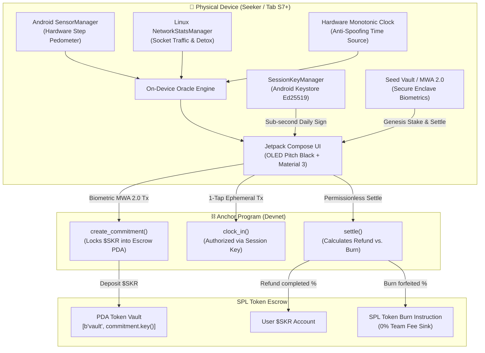

# ⚡ bozPledge (Clock In)
### Sovereign Physical Habit & Proof-of-Action Protocol on Solana Mobile
**Third Solana Mobile Hackathon: CLOCK IN (Fall 2026)**  
**Official Repository:** [https://github.com/elaris-xyz/bozPledge](https://github.com/elaris-xyz/bozPledge)  
**Smart Contract (Devnet):** [`68c1eNdHAfNWJhCWhtqumiqzYyFcDNLkfgwKwdFwFRcd`](https://explorer.solana.com/address/68c1eNdHAfNWJhCWhtqumiqzYyFcDNLkfgwKwdFwFRcd?cluster=devnet)  
**Target Hardware:** Solana Seeker & Android Devices (Tested live on Samsung Galaxy Tab S7+)

---

## 🌐 Official Showcase & Web Application (Vercel Ready)

The repository includes a standalone, dark-mode showcase web application located in [`/web`](./web), pre-configured for zero-config deployment on **Vercel** via [`vercel.json`](./vercel.json).

* **Live Features:**
  * **Interactive Device Showcase:** Real tablet screenshots running on Samsung Galaxy Tab S7+ hardware in OLED Pitch Black mode.
  * **Zero-Profit Slashing Simulator:** Interactive game-theory calculator modeling on-chain refunds vs. permanent deflationary burns.
  * **Direct APK Download:** Instant one-click download of [`bozPledge-v1.0.0-debug.apk`](./web/downloads/bozPledge-v1.0.0-debug.apk) (23.5 MB).
  * **Devnet Explorer & Contract Verification:** Program verification badge and 1-click clipboard integration.

---

## 🏆 Executive Summary & Vision

> **"From your failure, NO ONE profits. Not even us."**

Traditional habit apps and Web3 fitness games failed because they introduced predatory fee structures or inflationary tokenomic ponzis. When an app developer takes a percentage of your lost stake, they have a perverse incentive for you to fail.

**bozPledge** fundamentally rewrites this economic relationship:
* Users stake **$SKR** against verified physical and behavioral goals (steps, digital detox, early wake-up).
* Daily compliance is attested directly by **on-device hardware sensors** (Android `SensorManager`, `Health Connect`, `NetworkStatsManager`).
* Daily verification triggers a sub-second, 1-tap **"Clock In"** on Solana via an ephemeral Ed25519 session key.
* **Settlement Guarantee:**
  * Days successfully achieved are **refunded 100%** to the user.
  * Days forfeited are **permanently BURNED on-chain** via the SPL Token `burn` instruction.
  * **Developer / Protocol Take: 0.00%.** No rent-seeking. Lost discipline permanently contracts circulating supply, benefiting the broader Solana Seeker ecosystem.

### The Boz (Mountain Goat) Philosophy
Inspired by the legendary Mountain Goat (Boz) of rugged alpine ranges: fearless balance across vertical cliffs, sure-footed stamina, and unyielding grit. bozPledge converts fleeting motivation into immutable cryptographic commitment.

---

## 🎯 Hackathon Judging Criteria Alignment (4 x 25%)

| Evaluation Criterion | Score Alignment | Technical & Protocol Implementation |
| :--- | :---: | :--- |
| **1. Stickiness & PMF (25%)** | ⭐⭐⭐⭐⭐ | **A Literal Daily Ritual:** Users risk actual capital. Habit compliance is maintained through persistent home-screen glance widgets, low-latency status updates, and immutable streak milestones. |
| **2. User Experience (25%)** | ⭐⭐⭐⭐⭐ | **Sub-Second 1-Tap Clock-In:** Powered by an isolated **Ed25519 Session Key** in Android Keystore. Users avoid tedious repetitive wallet confirmation sheets during their daily routine while keeping primary keys secure in Seed Vault. |
| **3. Innovation & X-Factor (25%)** | ⭐⭐⭐⭐⭐ | **"The Phone is the Sovereign Oracle":** Zero centralized servers or backend APIs between the user's physical steps and on-chain escrow. Deflationary burn mechanism enforces unyielding game-theoretic accountability. |
| **4. Demo & Presentation (25%)** | ⭐⭐⭐⭐⭐ | **60-Second Judge Evaluation Lab:** Includes an integrated Hackathon Sandbox allowing judges to launch an instant pre-funded Devnet wallet (2,500 $SKR) and simulate Day 1-7 cycles, clock-ins, and slashing breaches in seconds. |

---

## 🪙 $10,000 $SKR Prize Integration

1. **Native Escrow Collateral:** $SKR is the required stake asset held in Program-Derived Address (PDA) token vaults (`[b"vault", commitment.key()]`).
2. **Deflationary Sink:** Slashing is executed strictly via `spl_token::instruction::burn`. Forfeited tokens never enter a team treasury; they are destroyed permanently on Solana Devnet.
3. **Seamless Network Targeting:** Connects out of the box to Solana Devnet RPC (`https://api.devnet.solana.com`) with automated token mint derivation.

---

## 🏗️ Technical Architecture


```mermaid
graph TD
    subgraph Mobile Hardware ["📱 Physical Device (Seeker / Tab S7+)"]
        SN["Android SensorManager<br/>(Hardware Step Pedometer)"] --> ORACLE["On-Device Oracle Engine"]
        NS["Linux NetworkStatsManager<br/>(Socket Traffic & Detox)"] --> ORACLE
        NTP["Hardware Monotonic Clock<br/>(Anti-Spoofing Time Source)"] --> ORACLE
        
        ORACLE --> UI["Jetpack Compose UI<br/>(OLED Pitch Black + Material 3)"]
        
        SK["SessionKeyManager<br/>(Android Keystore Ed25519)"] -->|Sub-second Daily Sign| UI
        SV["Seed Vault / MWA 2.0<br/>(Secure Enclave Biometrics)"] -->|Genesis Stake & Settle| UI
    end

    subgraph Solana Program ["⛓️ Anchor Program (Devnet)"]
        CI["create_commitment()<br/>(Locks $SKR into Escrow PDA)"]
        CLK["clock_in()<br/>(Authorized via Session Key)"]
        SET["settle()<br/>(Calculates Refund vs. Burn)"]
    end

    UI -->|Biometric MWA 2.0 Tx| CI
    UI -->|1-Tap Ephemeral Tx| CLK
    UI -->|Permissionless Settle| SET

    subgraph SPL Token Escrow
        VAULT["PDA Token Vault<br/>[b'vault', commitment.key()]"]
        USER_ACC["User $SKR Account"]
        BURN["SPL Token Burn Instruction<br/>(0% Team Fee Sink)"]
    end

    CI -->|Deposit $SKR| VAULT
    SET -->|Refund completed %| USER_ACC
    SET -->|Burn forfeited %| BURN
```

---

## 🔬 Core Components & Implementation

### 1. Smart Contract (Anchor / Rust)
* **Program ID:** [`68c1eNdHAfNWJhCWhtqumiqzYyFcDNLkfgwKwdFwFRcd`](https://explorer.solana.com/address/68c1eNdHAfNWJhCWhtqumiqzYyFcDNLkfgwKwdFwFRcd?cluster=devnet)
* **Location:** [`/anchor-program`](./anchor-program)
* **Key State Accounts:**
  * `Commitment`: PDA derived with seeds `[b"commitment", user.key(), commitment_id.to_le_bytes()]`. Records target metrics, total epoch duration (e.g., 7 days), completed day bitmap, and authorized session key.
  * `Vault`: PDA token account derived with seeds `[b"vault", commitment.key()]`. Holds escrowed $SKR until contract settlement.
* **Instructions:**
  * `create_commitment`: Transfers $SKR collateral from user to escrow PDA, initializes habit parameters, and delegates ephemeral session signer.
  * `clock_in`: Can be signed by either the user's primary wallet or the delegated session key. Validates current timestamp within the active 24-hour window and verifies hardware telemetry.
  * `settle`: Permissionless. Calculates proportional refund (`(completed_days / total_days) * stake`), executes `token::burn` for forfeited tokens, and closes accounts.

### 2. Android Application (Kotlin & Jetpack Compose)
* **Package:** `com.pledge.app`
* **Location:** [`/android-app`](./android-app)
* **Solana Mobile Stack:** Full implementation of `@solana-mobile/mobile-wallet-adapter-clientlib-ktx` (MWA 2.0) with relative `iconUri` compliance.
* **Dual Wallet Support:**
  1. *Production MWA 2.0:* Connects to Seed Vault, Phantom, or Solflare on Devnet.
  2. *Hackathon Judge Sandbox:* 1-Click instant Ed25519 keypair generation funded with 2,500 $SKR on Devnet with zero external wallet dependencies.
* **Hardware Sensors:**
  * `Sensor.TYPE_STEP_COUNTER` & `Sensor.TYPE_STEP_DETECTOR` via Android `SensorManager`.
  * `androidx.health.connect` integration for historical cadence analysis.
  * `NetworkStatsManager` for cellular and Wi-Fi byte auditing during detox challenges.

---

## ⚡ 60-Second Judge Evaluation Walkthrough

We built an integrated **Judge Evaluation Lab** directly into the Android application so hackathon judges can review and verify the entire lifecycle without waiting 7 days.

```
┌────────────────────────────────────────────────────────┐
│               STEP-BY-STEP EVALUATION GUIDE            │
├────────────────────────────────────────────────────────┤
│ 1. Launch & Connect:                                   │
│    • Tap "Instant Judge Devnet Keypair (1-Click)".      │
│    • Confirm the dialog to spawn a funded keypair.     │
│                                                        │
│ 2. Day 1 Verification:                                 │
│    • Tap the circular "CLOCK IN" button.               │
│    • Observe sub-second local signature verification.  │
│    • Day 1 checkmark turns green instantly.            │
│                                                        │
│ 3. Judge Evaluation Lab:                               │
│    • Tap "Judge Lab" in the top bar.                   │
│    • Select "Trigger Slashing Breach (Missed Day)".    │
│    • Notice 142.85 $SKR marked for burn.               │
│    • Select "Step Forward 1 Day (Time Machine)".       │
│                                                        │
│ 4. Vault & On-Chain Audit:                             │
│    • Navigate to the "Vault" tab.                      │
│    • Inspect Escrow balance and claim settled funds.   │
│    • Click "Solana Explorer" to audit the burn tx.     │
└────────────────────────────────────────────────────────┘
```

---

## 📦 Direct APK Installation

Pre-compiled, signed debug APKs are provided directly in the repository:

* **Direct Web / Local Download:** [`web/downloads/bozPledge-v1.0.0-debug.apk`](./web/downloads/bozPledge-v1.0.0-debug.apk) (23.5 MB)
* **GitHub Releases:** [Download Latest APK Release](https://github.com/elaris-xyz/bozPledge/releases)

### Fast Install via ADB
```bash
# Ensure your device or emulator is connected
adb devices

# Install APK directly
adb install -r web/downloads/bozPledge-v1.0.0-debug.apk
```

---

## 🛠️ Build and Development Setup

### 1. Smart Contract (Anchor)
```bash
cd anchor-program

# Install Node dependencies
npm install

# Build Anchor program
anchor build

# Execute Anchor automated tests
anchor test
```

### 2. Android App (Gradle)
```bash
cd android-app

# Build debug APK
./gradlew assembleDebug

# Install directly on connected device
./gradlew installDebug
```

---

## 📁 Repository Directory Structure

```
bozPledge/
├── .github/workflows/          # Automated GitHub Actions CI/CD for Android & Anchor
├── anchor-program/             # Solana Anchor Smart Contract (Rust)
│   ├── programs/pledge/src/    # Program instructions, state, and escrow logic
│   └── tests/                  # Mocha / TypeScript integration tests
├── android-app/                # Native Android application (Kotlin + Jetpack Compose)
│   └── app/src/main/java/com/pledge/app/
│       ├── data/               # HardwareTelemetry, DevnetRpc, HealthConnect
│       ├── solana/             # MWA 2.0, Seed Vault, and SessionKeyManager
│       └── ui/                 # Pitch OLED Screens, JudgeLabSheet, Catalog, Ranks
├── web/                        # Official Showcase Web App (Vercel Ready)
│   ├── assets/                 # High-resolution screenshots of physical Tab S7+
│   ├── downloads/              # Pre-compiled bozPledge-v1.0.0-debug.apk
│   ├── index.html              # Interactive landing page & showcase
│   ├── styles.css              # OLED Dark-Mode Design System
│   ├── app.js                 # Interactive screen switcher & slashing simulator
│   └── vercel.json             # Sub-directory Vercel deployment config
├── vercel.json                 # Root Vercel deployment configuration
├── README.md                   # Technical documentation and evaluation guide
└── LICENSE                     # Open-source MIT License
```

---

## 🛡️ License & Submission Notice

* **License:** [MIT License](./LICENSE)
* **Competition:** Third Solana Mobile Hackathon: CLOCK IN (Fall 2026)
* **Team:** Elaris XYZ
